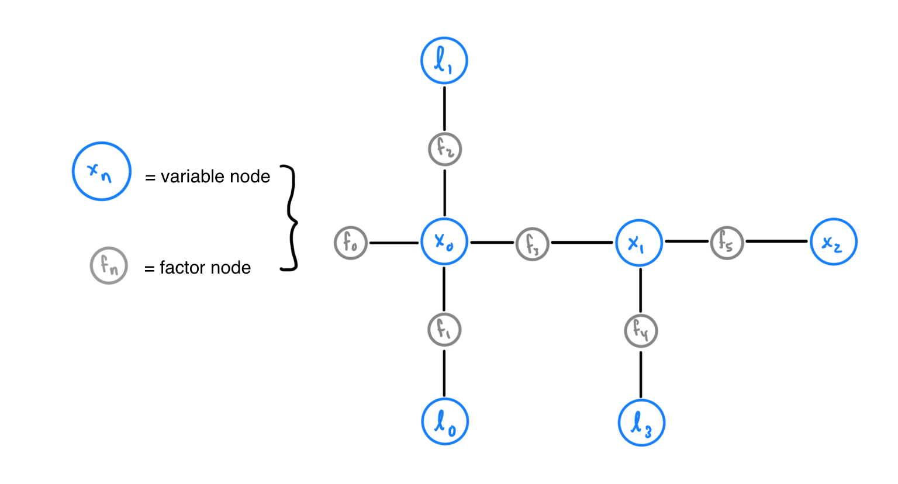
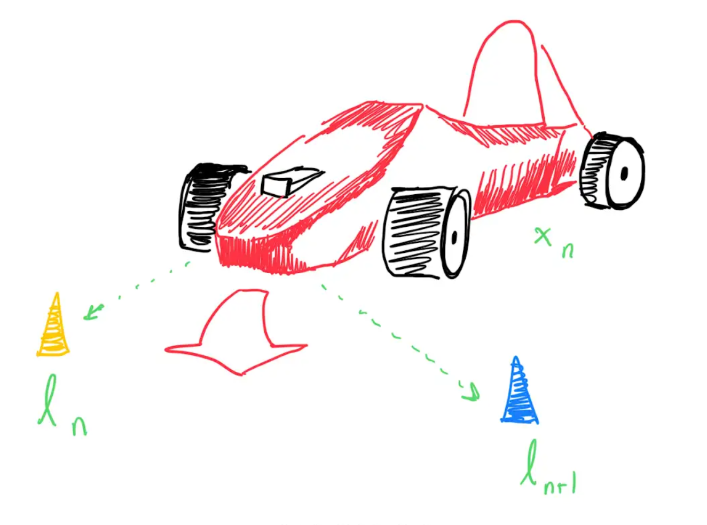
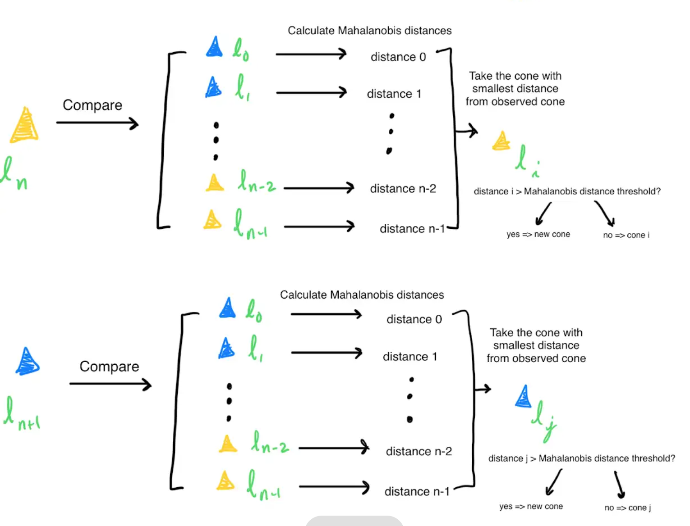
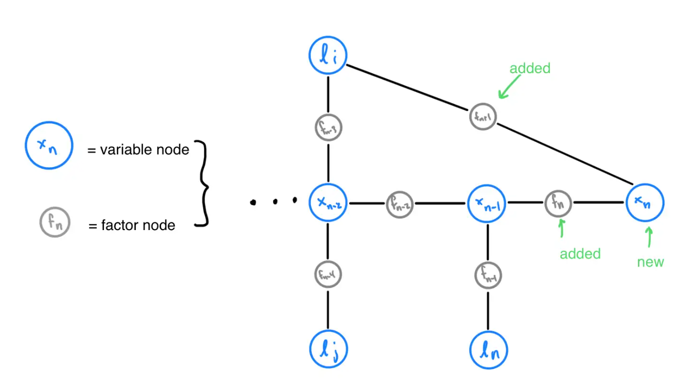

Explainers
=============

What is iSAM2 and Factor Graph SLAM?
------------------------------------

iSAM2 (Incremental Smoothing and Mapping) is a SLAM (Simultaneous Localization and Mapping) algorithm used to construct a map of the track from the car's position and the cones observed around the track. iSAM2 does this by constructing and optimizing a factor graph containing variables nodes (which represent either landmark poses or car poses) and factor nodes.

**The Factor Graph**
As stated previously, iSAM2 relies on a factor graph containing variable nodes and factor nodes. Factor nodes, akin to labeled edges between the variable nodes, represent a joint probability distribution on the variables nodes connected to it. This joint probability distribution represents how certain iSAM2 is of the corresponding variables' positions.

.. note:: A variable node cannot be adjacent to another variable node and a factor node cannot be adjacent to to another factor node. Blue nodes represent variable nodes (X variable nodes represent car poses, L variable nodes represent landmark positions). Gray nodes represent factor nodes. Factor node :math:`f_{0}` is called a prior factor node; prior factor nodes are added to the first pose and sometimes the first landmark for iSAM2 to use as reference when localizing and mapping future poses and landmarks.

For example, observe how in Figure 1, factor node :math:`f_{1}` is connected to variable node :math:`x_{0}`, representing the first car pose, and :math:`l_{0}`, representing the first landmark. :math:`f_{1}` represents a joint probabilistic distribution function over :math:`x_{0}` and :math:`l_{0}`, which indicates how certain iSAM2 is of the positions for :math:`x_{0}` and :math:`l_{0}`. Altogether, the entire factor graph represents a joint probabilistic distribution function F on all landmark positions and car poses. This function F is equal to the product of all factors :math:`f_{n}`, the joint probabilistic distribution function represented by each factor node in the graph.

**Goal with respect to the Factor Graph**
The goal of iSAM2 is to maximize the joint probabilistic distribution function F by maximizing its factors. Intuitively, iSAM2 is seeking to maximize its certainty of landmark positions and car poses by updating its estimates for car poses and landmark positions over time (with the help of incoming observations). Considering the previous example, iSAM2 can maximize this function F by maximizing the joint probability distribution function represented by :math:`f_{1}`.

**Implementation**

The iSAM2 node first parses the cones received by perceptions into separate vectors by color. This vector of observed cones and other odometry information is the used to update the iSAM2 model (:ref:`See isam2Node.cpp<isam2Node.cpp>`). Using the odometry information, the iSAM2 node predicts the car's current pose using the received odometry information. Variable node :math:`x_{n}`, representing the car pose at the current time stamp, is added alongside a factor node connecting :math:`x_{n}` to :math:`x_{n-1}`, the variable node representing the previous car pose.

After determining the car pose, data association is performed on the cones observed at the current timestamp to determine which of the observed cones are new. To perform this data association, the Mahalanobis distance is calculated between 1 observed cone, and all iSAM2 estimates for the previously seen cones. Intuitively, the Mahalanobis distance represents how much the observed cone resembles a previously seen cone (the smaller the distance, the more the observed cone resembles the previously seen cone). If the smallest distance is greater than the Mahalanobis Distance Threshold, then the observed cone is a new cone (:ref:`See isam2.cpp<isam2.cpp>`).

.. note:: The Mahalanobis distance threshold is generally found through tuning and trial and error.

.. note:: Mahalanobis distance is used instead of Euclidean distance because where Euclidean distance can calculate the distance between two points, Mahalanobis distance can calculate the distance between a point and a distribution. This is important because the cone positions come with uncertainty which is represented by a distribution (See `more`_)

.. _more: https://www.machinelearningplus.com/statistics/mahalanobis-distance/

This process is repeated for all observed cones. Each detected new cone must be added to the factor graph as a variable node with a factor node connected to :math:`x_{n}`, the variable node representing the current car pose.

Abstract ideas, math used, or technologies utilized (Brief)